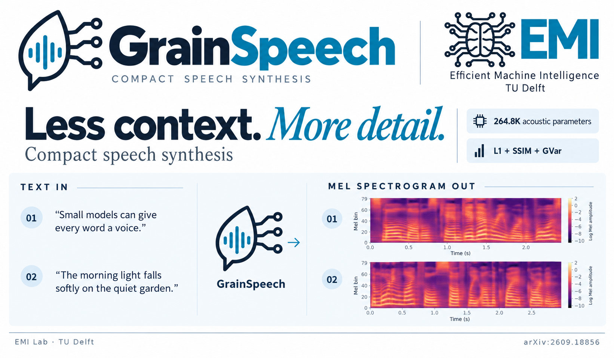
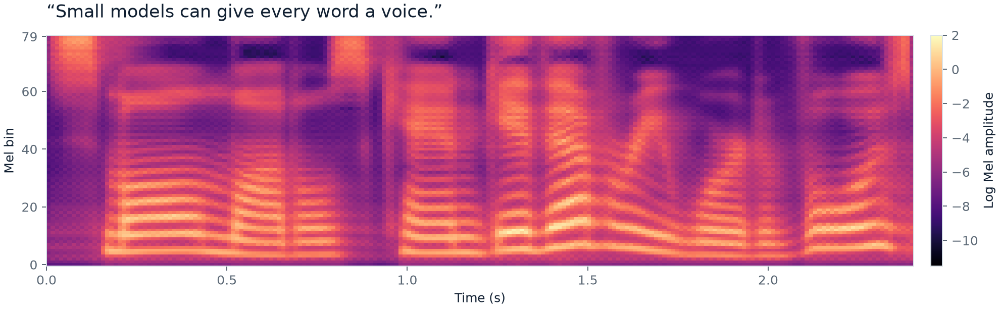
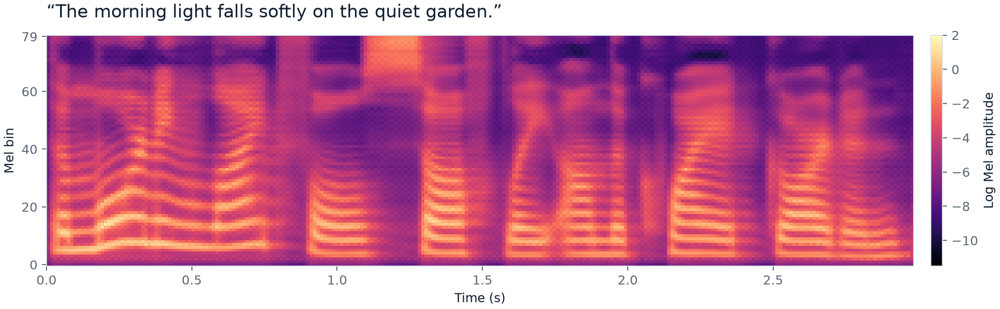
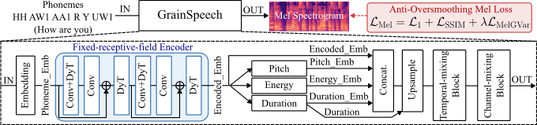

# GrainSpeech

**Less Context, More Detail for Compact Speech Synthesis**

**Authors:** Zitao Liang, Chang Gao\*  
\* Corresponding author.

This is the official repository for the paper
[**“GrainSpeech: Less Context, More Detail for Compact Speech Synthesis”**](https://arxiv.org/abs/2609.18856).
GrainSpeech is a **264.8K-parameter acoustic model** for compact text-to-speech
synthesis. It introduces two changes:

1. A **fixed-receptive-field convolutional encoder** that uses focused phoneme
   context for acoustic prediction.
2. An **anti-oversmoothing Mel loss** that combines L1, SSIM, and local
   gradient-variance (GVar) supervision.

[**Paper website & audio demos**](https://lab-emi.github.io/GrainSpeech/) ·
[Paper](https://arxiv.org/abs/2609.18856) ·
[Text → Spectrogram Examples](#text--spectrogram-examples) ·
[GrainSpeech Audio Demo](#grainspeech-audio-demo) ·
[GrainSpeech Quick Start](#grainspeech-quick-start) ·
[GrainSpeech Training](#grainspeech-training)

## Text → Spectrogram Examples

These examples were synthesized on CPU with the released
`grainspeech_l1_ssim_gvar.ckpt` checkpoint. Each plot shows the **predicted
80-bin log-Mel spectrogram directly from GrainSpeech**, before HiFi-GAN converts
it to audio. Both plots use the same color scale; time is in seconds.

**“Small models can give every word a voice.”** — 2.40 seconds



[Listen / download WAV](assets/examples/compact-speech.wav) ·
[Raw Mel array](assets/examples/compact-speech.npy)

**“The morning light falls softly on the quiet garden.”** — 2.98 seconds



[Listen / download WAV](assets/examples/morning-light.wav) ·
[Raw Mel array](assets/examples/morning-light.npy)

After the [Quick Start](#grainspeech-quick-start) installation, reproduce both
examples with:

```bash
python scripts/generate_readme_examples.py --device cpu
```

This writes the plots, WAV files, raw NumPy arrays, and a
[generation manifest](assets/examples/manifest.json) with the input phonemes,
checkpoint hash, settings, and package versions to `assets/examples/`.
The [banner artwork](assets/branding/README.md) illustrates this workflow;
the plots above are the original model outputs.

## Architecture



## GrainSpeech Audio Demo

Open the [**GrainSpeech paper website**](https://lab-emi.github.io/GrainSpeech/#demo)
to play samples directly on the page. Choose from five LJSpeech sentences and
compare 12 acoustic-model variants with the original recordings. All 65
comparison WAV files and their provenance now live in this repository, together
with the model, code and paper website.

The website is built from [`website/`](website/README.md) and deployed to GitHub
Pages automatically. See its README for local preview and editing instructions.

## GrainSpeech Quick Start

The reference environment uses Python 3.11, PyTorch 2.12, and Lightning 2.6.
The complete package snapshot is available in
`environment/reference-pip-freeze.txt`.

```bash
git clone https://github.com/lab-emi/GrainSpeech.git
cd GrainSpeech

python3.11 -m venv .venv
. .venv/bin/activate
python -m pip install --upgrade pip
python -m pip install -r requirements.txt
python -m nltk.downloader averaged_perceptron_tagger averaged_perceptron_tagger_eng cmudict
```

The last command installs the language resources used by `g2p-en` to convert
ordinary English text into ARPAbet phonemes. It only needs to be run once per
environment. Inference with `--phonemes` does not use this conversion step.

Synthesize English text with the released checkpoint:

```bash
python grainspeech/infer.py \
  --checkpoint checkpoints/grainspeech_l1_ssim_gvar.ckpt \
  --text "Grain Speech is a compact text to speech model." \
  --device cpu \
  --output outputs/grainspeech.wav
```

Use `--device cuda` for GPU inference. To control the pronunciation directly,
replace `--text` with a space-separated ARPAbet sequence, for example:

```bash
python grainspeech/infer.py \
  --checkpoint checkpoints/grainspeech_l1_ssim_gvar.ckpt \
  --phonemes "G R EY1 N S P IY1 CH" \
  --device cpu \
  --output outputs/grainspeech.wav
```

The released inference checkpoint contains the trained GrainSpeech acoustic model
and HiFi-GAN vocoder weights. The small `configs/LJSpeech/stats.json` file lets
inference run without downloading the training dataset. The standalone HiFi-GAN
file under `hifigan/LJ_V2/` is also kept because the current model
constructor uses it while loading the checkpoint and when starting a new
training run.

## GrainSpeech Training

Want to modify GrainSpeech or train your own variant? Complete the Quick Start
installation first, then prepare LJSpeech as follows.

### 1. Download LJSpeech

Download [LJSpeech 1.1](https://keithito.com/LJ-Speech-Dataset/) and extract it
directly under the repository's `data/` directory. The final location must be:

```text
GrainSpeech/
└── data/
    └── LJSpeech-1.1/
        ├── metadata.csv
        └── wavs/
```

In other words, `metadata.csv` must be available at
`data/LJSpeech-1.1/metadata.csv` when commands are run from the repository root.

### 2. Download the phoneme alignments

Download the precomputed
[LJSpeech TextGrids](https://drive.google.com/drive/folders/1DBRkALpPd6FL9gjHMmMEdHODmkgNIIK4).
Place the downloaded `.TextGrid` files at:

```text
GrainSpeech/data/LJSpeech-1.1/TextGrid/LJSpeech/
```

The `.TextGrid` files should be directly inside the final `LJSpeech/` folder,
not inside an additional nested directory.

A TextGrid records the time interval occupied by each phoneme in an utterance.
GrainSpeech uses these phoneme-to-audio alignments to obtain duration targets and
to align pitch, energy, and Mel-spectrogram features with the phoneme sequence.

We thank the [EfficientSpeech](https://github.com/roatienza/efficientspeech)
authors for their LJSpeech processing workflow. The preprocessing code in this
repository is adapted from EfficientSpeech, which follows the FastSpeech 2 data
pipeline.

### 3. Preprocess LJSpeech

Run the preprocessing command from the repository root:

```bash
python grainspeech/preprocess.py \
  --preprocess-config configs/LJSpeech/preprocess.yaml \
  --textgrid-dir data/LJSpeech-1.1/TextGrid \
  --device auto
```

`--device auto` uses CUDA when it is available and otherwise runs on CPU.

This command cleans the transcripts, prepares normalized waveforms, installs
the TextGrids, and generates Mel spectrograms, pitch, energy, durations,
metadata splits, and normalization statistics. It writes everything under the
local `data/LJSpeech-1.1/` directory rather than into Git:

```text
data/LJSpeech-1.1/
├── metadata.csv
├── wavs/
├── TextGrid/LJSpeech/
├── raw_data/LJSpeech/LJSpeech/
└── preprocessed_data/LJSpeech/
    ├── TextGrid/LJSpeech/
    ├── mel/
    ├── pitch/
    ├── energy/
    ├── duration/
    ├── train.txt
    ├── val.txt
    ├── speakers.json
    └── stats.json
```

Full preprocessing creates normalized waveform copies and NumPy feature files,
so make sure the `data/` directory has enough free disk space.

For a quick setup test, add `--limit 1`; do not use this option for full
training. Once preprocessing finishes, validate the data layout:

```bash
python scripts/check_setup.py
```

### 4. Train GrainSpeech

Train the paper model with L1, SSIM, and GVar supervision:

```bash
python grainspeech/train_l1_ssim_gvar.py \
  --run-name grainspeech-l1-ssim-gvar \
  --preprocess-config configs/LJSpeech/preprocess.yaml \
  --hifigan-checkpoint hifigan/LJ_V2/generator_v2 \
  --accelerator gpu --devices 1 --precision 16-mixed \
  --batch-size 128 --num_workers 4 --max_epochs 5000 \
  --lr 0.001 --weight-decay 0.00001 --infer-device cuda
```

The available training objectives are:

```text
grainspeech/train.py                  # L1
grainspeech/train_l1_ssim.py          # L1 + SSIM
grainspeech/train_l1_ssim_gvar.py     # L1 + SSIM + GVar (GrainSpeech)
```

Training checkpoints and TensorBoard logs are written under
`lightning_logs/<run-name>/`. Resume a full Lightning checkpoint by adding:

```bash
--checkpoint lightning_logs/<run-name>/checkpoints/last.ckpt
```

The released checkpoint in `checkpoints/` is inference-only and cannot resume
training. Add `--compile` to enable `torch.compile` for training.

The full LJSpeech dataset, TextGrids and generated training features stay outside
Git. Only the small published listening examples under `website/demo/audio/`
are included in the repository.

## Citation

```bibtex
@article{liang2026grainspeech,
  title   = {GrainSpeech: Less Context, More Detail for Compact Speech Synthesis},
  author  = {Liang, Zitao and Gao, Chang},
  journal = {arXiv preprint arXiv:2609.18856},
  year    = {2026},
  doi     = {10.48550/arXiv.2609.18856},
  url     = {https://arxiv.org/abs/2609.18856}
}
```
